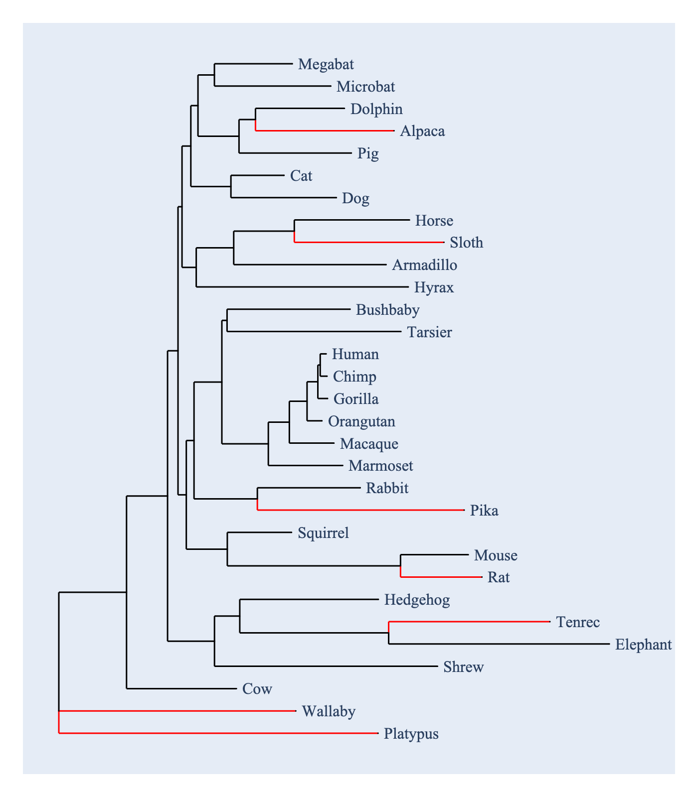

# Summary

alignment free, tree free, low compute cost, high scalability

sequences do not have to be related to each other

for many biological analyses, it's often beneficial to develop an understanding of the properties of a data set by working on a representative subset


it may be that the sampled data are descended from a common ancestor, or that they are not

Many analyses concerning biological sequences have poor scalability. For example, phylogenetic reconstruction, multiple sequence alignment, detecting the influence of natural selection. selection. The process of performing these expensive computational tasks can benefit from working on representative sequences. Existing solutions to this problem while themselves can be efficient may rely on a pre-processing step that is highly inefficient and has poor scalability. For instance, a phylogenetic tree provides a good basis for sampling representative sequences but the computational cost of producing that tree can be prohibitive. Here we present Divergent, an alignment free algorithm for efficiently sampling representative sequences.

Divergent is implemented using Python and provides both a command-line interface and cogent3 plugins. The output of Divergent is a set of representative sequences which can then be used for efficiently prototyping larger scale analyses.

# Statement of need

Many bioinformatics analyses are costly in terms of compute time. Tools that facilitate the development of smaller scale prototypes can accelerate the execution of research projects without requiring enormous resources. 

as the scale of data sets becomes larger, the value of identifying analysis parameters on a representative subset of the data increases

Current tools [@balaban.2019.plosone] require existence of a multiple sequence alignment or a phylogenetic tree or a pairwise distance matrix. These are effectively updates of earlier approaches [@widmann.2006.molcellproteomics]. The algorithms for these approaches require either distance matrices or homologous sequences as input. Each of those components is in turn computationally expensive.

Divergent is more flexible than published approaches. It is alignment free and does not require sequences to be related. As we show, in the case of homologous sequences, the set selected by divergent is comparable to what would be expected under published approaches. Moreover, the algorithm is linear in time.


if we imagine a 1D line, the idea is to sample points that are approximately evenly dispersed along the line

# Definitions

A $k$-mer is a subsequence of length $k$ and a $k$-mer probability vector has elements corresponding to the frequency of each $k$-mer in a sequence. The Shannon entropy of a probability vector is calculated as $H=-\sum_i p_i \log_2 p_i$ where $p_i$ is the probability of the $i$-th $k$-mer. A DNA sequence with equifrequent nucleotides has the maximum possible $H=2$ while a sequence with a single nucleotide has $H=0$. Thus, this quantity represents a measure of "uncertainty" in the vector and is commonly used in sequence analysis, for example to define information content of DNA sequences as displayed in sequence logos [@schneider.1990.nucleicacidsres]. Shannon entropy is an important component of other statistical measures that quantify uncertainty, including Jensen-Shannon divergence (JSD) which we employ in this work [@lin.1991.ieeetrans.inf.theory]. 

For a collection of DNA sequences $\mathbb{S}$ with size $N$, define $f_i$ as the $k$-mer frequency vector for sequence $s_i, s_i \in \mathbb{S}$. The JSD for the resulting set of vectors, $\mathbb{F}$, is

\begin{equation*}
JSD(\mathbb{F})=H \left( \frac{1}{N}\sum_i^N f_i \right) - \overline{H(\mathbb{F})}
\end{equation*}

where the first term corresponds to the Shannon entropy of the mean of the $N$ probability vectors and the second term $\overline{H(\mathbb{F})}$ is the mean of their corresponding Shannon entropies.

For vector $f_i$, its contribution to the total JSD of $\mathbb{F}$ is

\begin{equation}
\delta_{JSD}(i)=JSD(\mathbb{F})-JSD(\mathbb{F} - \{i\})
\end{equation}\label{eqn:delta-jsd}

From \autoref{eqn:delta-jsd} it becomes clearer that to efficiently update the entropy measure of a collection we only need to keep track of the totals of each $k$-mer across the sequences in the collection, and the total Shannon entropy. Thus, the algorithm can be implemented with a single pass through the data.

Add a figure describing the core algorithm as a flow chart.

# Algorithm

The `dvgt prep` sub-command converts plain text sequence data into an on disk storage format that is more efficient for interrogation in the other steps. A user can provide either fasta or GenBank formatted DNA sequence files. The sequences are converted into unsigned 8-bit integer numpy arrays and stored in a single HDF5 file on disk. The resulting `.dvgtseqs` file is required for both the `max` and `nmost` commands.


 A directory of these files is converted into a single HDF5 file on disk in which .

**Algorithm 1** The divergent `max` algorithm.\label{algorithm:max}

```python
records: list[KmerSeq]  # a list of sequence converted into k-mer counts
min_size: int  # the minimum size of the divergent set
max_size: int  # the maximum size of the divergent set
shuffle(records)  # randomise the order of the records

# SummedRecords sorts records by their delta-JSD. The record
# with the lowest delta-JSD is excluded from the N-1 set.
sr = SummedRecords.from_records(records[:min_size])
for r in records:
    if sr.increases_jsd(r):
      # Adding r to the N-1 set increased JSD over sr.jsd
      nsr = sr + r  # create a new set with the current set and r
      sr = nsr if nsr.std > sr.std else sr.replaced_lowest(r)
      # if the new set has a higher standard deviation, keep the new set
      # otherwise retain the same set size, but replace the lowest record.
      if sr.size > max_size:
        # we stay within the user specified limits
        sr = sr.dropped_lowest()
```

We transform integer sequences into k-mer counts by transforming a series of consecutive bases into a single unsigned 64-bit integer. 

# `dvgt` command line application

- `prep`converts sequences into numpy arrays for faster processing
- `nmost` samples the n sequences that increase JSD 
- `max` samples divergent sequences that maximise a user specified statistic, either the standard deviation or the coefficient of variation of $JSD_{\delta}$.

# `dvgt` cogent3 apps

counterparts to the above

# Performance

## recovery of representatives from synthetic knowns

## Testing a hypothesis about the relationship with tree-based sampling

For homologous DNA sequences, increasing the amount of elapsed time since they shared a common ancestor increases their genetic distance. We also expect that the JSD between two sequences will increase proportional to the amount of time since they last shared a common ancestor. These lead to the expectation that there should be a relationship between genetic distance and JSD. This in turn leads us to formulate the following hypothesis for a divergent set with $N$ sequences. If JSD is uninformative, then the set of sequences chosen by `divergent` will be no better than a randomly selected set of size $N$. Under the alternate hypothesis, we expect the minimum genetic distance between the sequences chosen by `divergent` will be larger than that between a randomly selected set of $N$ sequences.


If DNA sequences are homologous, then `divergent` should select sets of sequences for which their minimum genetic distance is near the upper tail of the distribution of this measure from a sampling of combinations of the same (or different size).

The column labelled "P-value<0.05" identifies how many of `num` genes for which the divergent set species gave a p-value $\le 0.5$ (this value was arbitrarily chosen). The distribution for each gene was obtained by taking of the mean of 1000 randomly chosen (without replacement) combinations of species.

The relationship between the statistic chosen, k and whether a post-process pruning was done all had an effect. For this data set, the combination `mean_delta_jsd`, `max_set=False` and `k=4` produced the largest relationship with genetic distance.

### Data set used for evaluating statistical performance

We used 106 alignments of protein coding DNA sequences from the following 31 mammals: Alpaca, Armadillo, Bushbaby, Cat, Chimp, Cow, Dog, Dolphin, Elephant, Gorilla, Hedgehog, Horse, Human, Hyrax, Macaque, Marmoset, Megabat, Microbat, Mouse, Orangutan, Pig, Pika, Platypus, Rabbit, Rat, Shrew, Sloth, Squirrel, Tarsier, Tenrec and Wallaby. The sequences were obtained from Ensembl.org [@harrison.2024.nucleicacidsresearch] and aligned using cogent3's codon aligner.

As shown in \autoref{fig:jsd-v-dist}, the sensitivity

The choice of statistic has an impact on the number of selected sequences.

## compute time

As shown in \autoref{fig:compute-time}, the compute time was linear with respect to the number of sequences on random samples of the microbial genomes.

Using 10 cores on a MacBook Pro M2 Max, application of `dvgt prep` followed by `dvgt nmost` to the 10560 microbial genome WOL data set took 8'13" and 4'32" (to select 100 sequences) respectively.

### The cogent3 apps enable simplified usage

We provide `dvgt_select_max` and `dvgt_select_nmost` as Cogent3 plugins. 

# Figures

{#fig:jsd-v-dist}

{#fig:selected-edges}

{#fig:compute-time}

# Tables


**Table 1** Jensen-Shanon Divergence (JSD) for different relationships between two sequences.\label{JSD-examples}

+--------------+--------+--------+-----+
| Relationship |   seq1 |   seq2 | JSD |
+==============+========+========+=====+
|    Identical | `ATCG` | `TCGA` | 0.0 |
+--------------+--------+--------+-----+
|   No overlap | `AAAA` | `TTTT` | 1.0 |
+--------------+--------+--------+-----+
| Intermediate | `ATCG` | `ATCC` | 0.5 |
+==============+========+========+=====+


# Acknowledgements

blah blah

# References